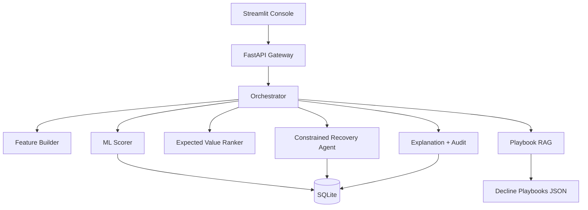

# Architecture diagram (Mermaid) — include in README demos / interviews

```mermaid
flowchart TD
  UI[Streamlit Console] --> API[FastAPI Gateway]
  API --> ORCH[Orchestrator]
  ORCH --> FEAT[Feature Builder]
  ORCH --> ML[ML Scorer]
  ORCH --> EV[Expected Value Ranker]
  ORCH --> RAG[Playbook RAG]
  ORCH --> AGENT[Constrained Recovery Agent]
  ORCH --> EXPL[Explanation + Audit]
  ML --> DB[(SQLite)]
  AGENT --> DB
  EXPL --> DB
  RAG --> PB[Decline Playbooks JSON]
```
