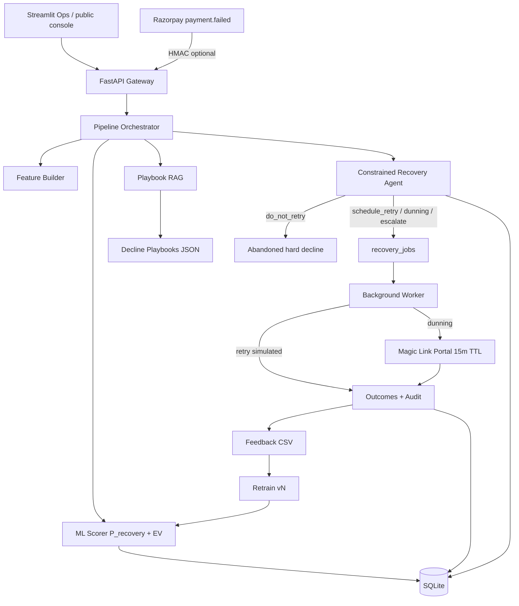

# Architecture diagram (Mermaid) — include in README demos / interviews

## Key contracts
- Ingest: `POST /webhooks/razorpay` (idempotent)
- Story: `GET /demo/story` (canonical proof numbers)
- Portal: `GET|POST /recover/{token}` (hashed, single-use, 15 min)
- KPIs: `GET /kpis`
- Retrain: `POST /admin/retrain`
